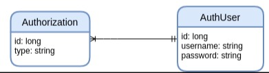

# API Spring Boot RESTful

[](https://www.docker.com/)
[](https://www.postgresql.org/)


Construindo a base da aplicação com o gerenciador de containers docker, onde baixar a imagem docker para o banco de dados Postgres. Para começar a desenvolver nossa API, precisamos configurar um banco de dados. Nesta etapa vamos utilizar o Sistema Gerenciador de Banco de Dados PostgreSQL hospedado em um container Docker.

## Docker

Com o [**Docker**](https://www.docker.com/) instalado, vamos baixar a imagem docker do banco de dados Postgres:

```
docker pull postgres
```

Vamos executar um container com esta imagem com o seguinte comando:

```
docker run --name postgresql -p 5480:5432 -e POSTGRES_PASSWORD=postgres -d postgres
```

Verifique se o container está rodando na porta selecionada, com o comando:

```
docker ps
```

Este comando deve gerar uma saída parecida com esta:

```
CONTAINER ID   IMAGE      COMMAND                 CREATED         STATUS         PORTS                    NAMES
b47947e7ba5e   postgres   "docker-entrypoint.s…"  6 seconds ago   Up 2 seconds   0.0.0.0:5480->5432/tcp   postgresql
```

## PostgreSQL

Já temos um banco de dados rodando em nossa máquina, conseguimos acessá-lo utilizando a interface de linha de comando PSQL, mas como configurar, criar usuários, salvar e exportar os dados para edição? Estudar os comandos básicos para utilizar um software é o primeiro passo. Para executar os comandos aqui listados é necessário ter a instalação do [PostgreSQL](https://www.postgresql.org/) linha de comando.

Vamos entrar na interface de linha de comando do banco de dados PostgreSQL utilizando o camando abaixo (Nós definimos a senha no camando acima -e POSTGRES_PASSWORD=postgres):

```
psql -h 0.0.0.0 -p 5480 -U postgres
```

Vamos criar um banco de dados novo com o comando abaixo, nunca utilize o banco de dados de nome postgres, sempre crie um novo com um novo usuário Lembre-se que a senha do usuário root defininos como `postgres`:

```
createdb -h 0.0.0.0 -p 5480 -U postgres users_control "Controle de usuários"
```

Vamos testar a conexão com o banco de dados recém criado utilizando o comando abaixo:

```
psql -h 0.0.0.0 -p 5480 -U postgres -d users_control
```

Com a interface de linha de comando em aberto, execute a seguinte linha em SQL:

```
SELECT table_name FROM information_schema.tables WHERE table_schema='public';
```

Bom a saída deve ser parecida com essa:

```
users_control=# SELECT table_name FROM information_schema.tables WHERE table_schema='public';
 table_name
------------
(0 rows)
```

Estamos com 0 tabelas em nosso banco de dados, vamos salvar alguns dados então? Mas antes vamos criar um usuário para nossa aplicação, lembrando que o recomendado é que a aplicação nunca utilize o usuário root do banco de dados. Para criar um usuário (é claro que precisamos estar com o CLI do banco em aberto), vamos executar o comando abaixo em PSQL:

```
CREATE USER api_restful WITH PASSWORD 'api_spring_restful';
```

Se o resultado foi ```CREATE ROLE``` quer dizer que ocorreu tudo bem, mas para ter certeza vamos sair da linha de comando do BD e vamos entrar de novo com o novo usuário (para sair é simples `Ctrl + D`):

```
psql -h 0.0.0.0 -p 5480 -U api_restful -d users_control
```

Pronto agora podemos relaxar, pois não estamos mais com o poderes do root (o símbolo # foi substituído por >). Agora que sabemos que o novo usuário está funcionando, vamos salvar alguns dados em nome dele (Ctrl + D mais uma vez).

Nossos dados possuem a seguinte estrutura, mas lembrando que podemos salvar de várias formas:

<p align = "center">
  
</p>

Possuímos nossos dados em tabelas CSV, e vamos importá-las utilizando o seguinte comando que vai executar o [arquivo sql](./create_tables.sql), explicado no vídeo:

```
psql -h 0.0.0.0 -p 5480 -U postgres -d shapes -f create-tables.sql
```

Verifique se as tabelas foram criadas utilizando o comando usado anteriormente:

```
users_control=> SELECT table_name FROM information_schema.tables WHERE table_schema='public';
     table_name
---------------------
 users
 user_authorizations
(2 rows)
```

Tente acessar as tabelas utilizando os comandos básicos do SQL:

```
users_control=> select * from users;
 id | username |                           password
----+----------+--------------------------------------------------------------
  1 | admin    | $2a$10$TS76TLIpbza7YTiRbX3FBunc56D9MgeFoMXHqqiJOIn0LW9asLnyC
  2 | user     | $2a$10$GEBIkDxEZDC5X35r86W0SelBMDM45/lbp3CpJvaPmq4YT9TWb2Z6O
(2 rows)
```

Agora quero exportar esses dados para executar em outra máquina.
Executar os comandos um de cada vez abaixo para exportar as tabelas no banco de dados:

```
psql -h 0.0.0.0 -p 5480 -U postgres -d users_control \
    -c "\COPY users TO '/home/${USER}/csv/users_exported.csv' DELIMITER ';' CSV HEADER;"
```

```
psql -h 0.0.0.0 -p 5480 -U postgres -d users_control \
    -c "\COPY user_authorizations TO '/home/${USER}/csv/user_authorizations_exported.csv' DELIMITER ';' CSV HEADER;"
```

> Se deu um erro, execute o seguinte comando para autorizar a excrita do banco de dados na pasta (No linux), execute os comandos acima mais uma vez e os dados estaram nesta pasta:

```
mkdir /home/${USER}/csv && sudo chmod 777 /home/${USER}/csv
```

> **Obs.: Todos os comandos e tecnologias são explicados nos [vídeos no youtube](https://www.youtube.com/playlist?list=PLyBgv5rSdkMYgPsmDJg-6sgh4UmmSmnOd).**